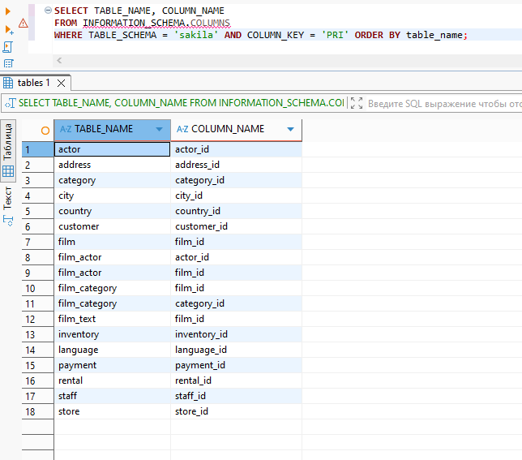

# Домашнее задание к занятию "`Работа с данными (DDL/DML)`" - `Смирнов Егор`

---

### Задание 1

1. `Поднимите чистый инстанс MySQL версии 8.0+. Можно использовать локальный сервер или контейнер Docker.`
2. `Создайте учётную запись sys_temp.`
```
CREATE USER 'sys_temp'@'localhost' IDENTIFIED BY '123';
```
3. `Выполните запрос на получение списка пользователей в базе данных. (скриншот)`
```
SELECT user, host FROM mysql.user;
```

4. `Дайте все права для пользователя sys_temp.`
```
GRANT ALL PRIVILEGES ON *.* TO 'sys_temp'@'localhost';
FLUSH PRIVILEGES;
```
5. `Выполните запрос на получение списка прав для пользователя sys_temp. (скриншот)`
```
SHOW GRANTS FOR 'sys_temp'@'localhost';
```

6. `Переподключитесь к базе данных от имени sys_temp.`
```
ALTER USER 'sys_temp'@'localhost' IDENTIFIED WITH mysql_native_password BY '123';

-- SQL Error [1524] [HY000]: Plugin 'mysql_native_password' is not loaded
```
`Создал новое соединение:`


7. `По ссылке https://downloads.mysql.com/docs/sakila-db.zip скачайте дамп базы данных.`
8. `Восстановите дамп в базу данных.`
9. `При работе в IDE сформируйте ER-диаграмму получившейся базы данных. При работе в командной строке используйте команду для получения всех таблиц базы данных. (скриншот)`


---

### Задание 2

1. `Составьте таблицу, используя любой текстовый редактор или Excel, в которой должно быть два столбца: в первом должны быть названия таблиц восстановленной базы, во втором названия первичных ключей этих таблиц. Пример: (скриншот/текст)`

```
SELECT TABLE_NAME, COLUMN_NAME
FROM INFORMATION_SCHEMA.COLUMNS
WHERE TABLE_SCHEMA = 'sakila' AND COLUMN_KEY = 'PRI' ORDER BY table_name;
```


